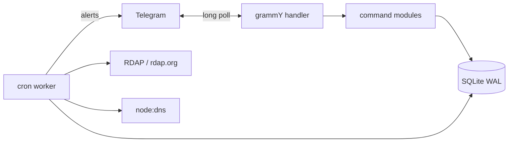

<div align="center">

```
$ whois domainer

% IANA WHOIS server
% This query returned 1 object

██████╗  ██████╗ ███╗   ███╗ █████╗ ██╗███╗   ██╗███████╗██████╗
██╔══██╗██╔═══██╗████╗ ████║██╔══██╗██║████╗  ██║██╔════╝██╔══██╗
██║  ██║██║   ██║██╔████╔██║███████║██║██╔██╗ ██║█████╗  ██████╔╝
██║  ██║██║   ██║██║╚██╔╝██║██╔══██║██║██║╚██╗██║██╔══╝  ██╔══██╗
██████╔╝╚██████╔╝██║ ╚═╝ ██║██║  ██║██║██║ ╚████║███████╗██║  ██║
╚═════╝  ╚═════╝ ╚═╝     ╚═╝╚═╝  ╚═╝╚═╝╚═╝  ╚═══╝╚══════╝╚═╝  ╚═╝

domain:       DOMAINER
status:       ACTIVE
status:       SHIPPING
status:       COLLECTING

registrant:   Kukuh Laksana
country:      ID

source:       github.com/kwkuh/domainer
```

# Domainer

**The open-source domain portfolio manager that lives in your Telegram.**

[](LICENSE)
[](https://nodejs.org)
[](https://www.typescriptlang.org/)
[](#-features)
[](CONTRIBUTING.md)
[](https://github.com/kwkuh/domainer/stargazers)

[Quick start](#-quick-start) · [Commands](#-commands) · [Self-hosting](#%EF%B8%8F-self-hosting) · [Why](#-why-domainer) · [Roadmap](#%EF%B8%8F-roadmap) · [Contributing](CONTRIBUTING.md)

</div>

---

> [!NOTE]
> Domainer is in **active early development** (`v0.1.x`). The command surface is stable; the schema and config may still shift. Pin to a tag if you want strict reproducibility.

## ✨ Features

|     | What it does                                                                                       |
| --- | -------------------------------------------------------------------------------------------------- |
| 📋  | Full portfolio CRUD with tags, notes, categories, BIN / buy / floor prices                         |
| 🔍  | RDAP-based WHOIS, expiry, registrar, NS, age, status (free, IANA-blessed bootstrap)                |
| ⏰  | Configurable expiry reminders + automatic alerts via cron worker                                   |
| 🎯  | Availability check + multi-TLD keyword scan (`/check fintech --tlds=com,io,ai,co`)                 |
| 🏆  | Deterministic brandability scoring — length, vowel ratio, pronounceability, TLD weight, keywords  |
| 🔄  | Variant generators: typo / plural / singular / hyphen permutations                                 |
| 🌐  | DNS lookups (A / AAAA / MX / TXT / CNAME / SOA / SPF / DMARC)                                      |
| 🅿️  | Parking provider detection via NS fingerprints (Sedo, Dan, Afternic, Bodis, ParkingCrew, GoDaddy)  |
| 👀  | Watchlist — alert on NS change, status change, expiry approach, becoming available                 |
| 📊  | Dashboard: totals, expiring counts, top TLDs / registrars, BIN values, ROI                         |
| 💾  | Import / export CSV / JSON / NDJSON / TXT — just send the file to the bot                          |
| 🩺  | Health audit — domains missing BIN, tag, or note; expired entries                                  |

---

## 🚀 Quick start

The fastest way is Docker. You'll need a Telegram bot token from [@BotFather](https://t.me/BotFather).

```bash
git clone https://github.com/kwkuh/domainer.git
cd domainer
cp .env.example .env       # paste your BOT_TOKEN
docker compose up -d
```

Open Telegram, find your bot, send `/help`. You're in.

<details>
<summary><strong>Other ways to run it</strong></summary>

### From source (Node 20+ or Bun)

```bash
git clone https://github.com/kwkuh/domainer.git
cd domainer
cp .env.example .env       # paste your BOT_TOKEN
npm install
npm run build
npm start
```

For hot reload during development:

```bash
npm run dev
```

### One-shot with `npx`

After the package is published to npm:

```bash
BOT_TOKEN=xxx npx @kwkuh/domainer
```

### Pre-built Docker image (GHCR)

```bash
docker run -d \
  --name domainer \
  --restart unless-stopped \
  -e BOT_TOKEN=xxx \
  -v $(pwd)/data:/data \
  ghcr.io/kwkuh/domainer:latest
```

</details>

---

## 💬 Commands

Send `/help` to your bot for the live list. A taste:

```text
/add domain.com --buy=12 --bin=2500 --tag=ai,brandable
/list --expiring=30
/whois domain.com
/score domain.com
/check fintech --tlds=com,io,ai,co
/typo tokopedia.com
/upcoming --days=14
/remind domain.com --days=7
/watch domain.com
/dashboard
/export --format=csv
```

Send any `.csv` / `.json` / `.txt` file (one domain per line) to bulk import.

<details>
<summary><strong>Full command reference</strong></summary>

**Portfolio** — `/add` `/list` `/detail` `/remove` `/restore` `/purge` `/pin` `/unpin` `/star` `/unstar`

**WHOIS / RDAP** — `/whois` `/expiry` `/registrar` `/ns` `/age` `/available` `/check`

**Expiry & renewals** — `/upcoming` `/expired` `/renew` `/remind`

**Metadata** — `/tag` `/untag` `/tags` `/note` `/notes` `/cost` `/bin` `/floor` `/category`

**Search** — `/find` with `--contains` `--starts-with` `--ends-with` `--length` `--tld` `--tag` `--expiring` `--registrar`

**Scoring** — `/score` `/brandability` `/length` `/vowel-ratio` `/typo` `/plural` `/singular` `/hyphen`

**DNS** — `/dns` `/a` `/aaaa` `/mx` `/txt` `/cname` `/soa` `/spf` `/dmarc` `/parking`

**Watchlist** — `/watch` `/unwatch` `/watchlist` `/watchns` `/watchexpiry` `/watchstatus`

**Dashboard** — `/dashboard` `/stats` `/summary` `/health`

**Import / export** — `/export` + send a `.csv` / `.json` / `.txt` document to import

</details>

---

## ⚙️ Self-hosting

All config via `.env`:

| Variable         | Default              | Description                                                     |
| ---------------- | -------------------- | --------------------------------------------------------------- |
| `BOT_TOKEN`      | _(required)_         | Telegram bot token from @BotFather                              |
| `ALLOWED_USERS`  | _(empty = open)_     | Comma-separated Telegram user IDs allowed to use the bot        |
| `DATA_DIR`       | `./data`             | Where the SQLite database is stored                             |
| `TICK_MINUTES`   | `60`                 | How often the cron worker refreshes RDAP and fires alerts       |
| `RDAP_BOOTSTRAP` | `https://rdap.org`   | RDAP bootstrap URL (override only if you run a mirror)          |

> Get your Telegram user ID from [@userinfobot](https://t.me/userinfobot).

### Backup

Your portfolio is a single SQLite file at `$DATA_DIR/domainer.sqlite` (WAL mode). Copy it. That's the entire backup procedure.

```bash
cp data/domainer.sqlite "backups/domainer-$(date +%F).sqlite"
```

---

## 🧱 Architecture



```
src/
├── index.ts          entry point — grammY setup + command registry
├── cron.ts           hourly worker: RDAP refresh + alert dispatch
├── lib/
│   ├── db.ts         SQLite schema + migrations (better-sqlite3)
│   ├── rdap.ts       RDAP client with port-43 WHOIS fallback
│   ├── whois.ts      legacy WHOIS over TCP/43 for non-RDAP TLDs
│   ├── dns.ts        node:dns wrappers + parking detection
│   ├── score.ts      deterministic scoring + similarity engine
│   └── format.ts     output formatting helpers
└── commands/
    ├── portfolio.ts  whois.ts  expiry.ts  meta.ts  search.ts
    ├── score.ts      dns.ts    watch.ts   dashboard.ts
    ├── sales.ts      drop.ts   landing.ts history.ts
    └── io.ts         help.ts
```

---

## 🤔 Why Domainer

|                                          | Registrar dashboard | DomainIQ / Estibot SaaS | Spreadsheet | **Domainer** |
| ---------------------------------------- | :-----------------: | :---------------------: | :---------: | :----------: |
| Works across all your registrars         |         ❌          |           ✅            |     ✅      |      ✅      |
| Live WHOIS / expiry / NS monitoring      |         🟡          |           ✅            |     ❌      |      ✅      |
| Brandability scoring                     |         ❌          |           ✅            |     ❌      |      ✅      |
| Watchlist alerts in chat                 |         ❌          |           🟡            |     ❌      |      ✅      |
| Costs nothing per month                  |         ✅          |           ❌            |     ✅      |      ✅      |
| Self-hosted — your data stays yours      |         ❌          |           ❌            |     ✅      |      ✅      |
| Open source, scriptable, hackable        |         ❌          |           ❌            |     🟡      |      ✅      |

Domainer is the open-source middle ground: **your portfolio, your data, your bot, in your pocket.**

---

## 🗺️ Roadmap

- [ ] Vendor registrar adapters (Namecheap, Porkbun, Spaceship, Cloudflare, Dynadot) — plugin folder, disabled by default
- [ ] Auction watchers — ExpiredDomains.net, GoDaddy auctions RSS
- [ ] Team workspaces with role-based access (viewer / editor / owner)
- [ ] Sales pipeline — `/lead`, `/offer`, `/counter`, `/sold`
- [ ] Bulk filter DSL — `/bulk-tag --filter=tag:premium length<10`
- [ ] Read-only web dashboard (same SQLite, optional)
- [ ] Inbound-offer parser — forward an email, auto-extract the offer

Vote with 👍 on [issues](https://github.com/kwkuh/domainer/issues) or open one.

---

## 🤝 Contributing

PRs are very welcome. The codebase is ~2k lines of TypeScript with no exotic patterns — read it end to end in an hour. Start with [CONTRIBUTING.md](CONTRIBUTING.md), pick something from the roadmap, or scratch your own itch.

Ground rule: **no paid APIs, ever.**

---

## 🔐 Security

Please report vulnerabilities privately via [GitHub Security Advisories](https://github.com/kwkuh/domainer/security/advisories/new). See [SECURITY.md](SECURITY.md).

---

## 📄 License

[MIT](LICENSE) © Domainer contributors

---

<div align="center">

<sub>Built by domain investors, for domain investors. No SaaS, no API bills, no lock-in.</sub>

</div>
